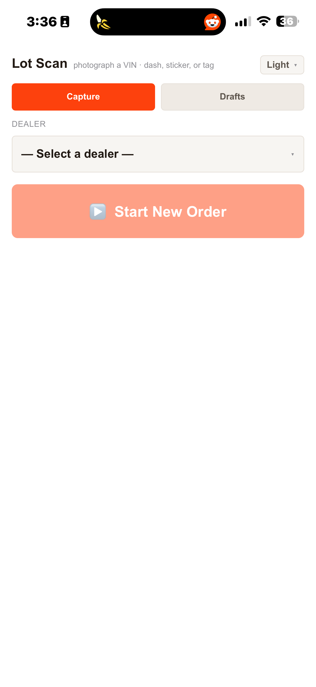
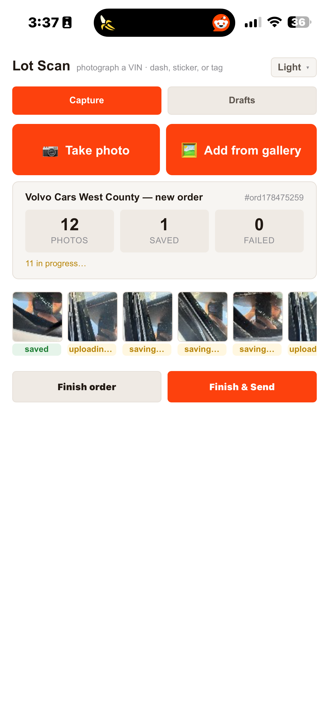
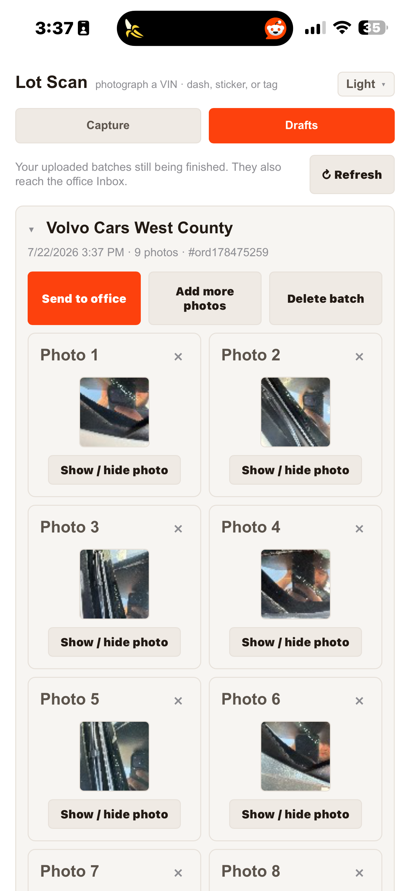

# Field Crew Handbook — Lot Scanner

The Lot Scanner is the phone app you use to photograph VINs on a dealer lot. You take
the pictures; the office reads the VINs from them later. **The app never shows you a
VIN count — that's normal.** Your job is just clean photos of every VIN label (dash,
sticker, or tag), sent to the office.

---

## First-time setup

**When you do this:** once, on your own phone, before your first lot visit.

**Before you start:** Nick must add you first (app access + photo-folder access).
If a step below fails, stop and tell Nick — it's almost always a permissions thing
on his end, not yours.

1. Open the Lot Scanner link Nick sent you (save it to your home screen — in your
   phone browser (only works with Safari if you're on iPhone) use **Share → Add to Home Screen** so it opens like an app).
2. Sign in with your **work Google account** when Google asks. The first time, Google
   shows a permissions screen — approve it.
3. You should see the app: **Lot Scan** at the top, with a **Dealer** dropdown and a
   **▶ Start New Order** button.
   
4. Optional: tap **Theme ▾** (top right) to pick a look (Light, Dark, Midnight HC,
   Encarta, Sage, Gruvbox, Slate, Windows XP). It remembers your choice.
5. The first time you tap **📷 Take photo**, your phone asks for camera permission —
   allow it. Same for photo-library permission when you first use **🖼 Add from gallery**.

**What good looks like:** the dealer dropdown fills with dealer names (not stuck on
"Loading…"), and Start New Order lights up once you pick one.

**If something goes wrong:**
- Page asks you to request access, or dealers never load ("Could not load dealers: …") →
  tell Nick; you're not set up yet.
- Signed into the wrong Google account → sign out of the browser or switch accounts,
  then reopen the link.

---

## Scan a lot

**When you do this:** whenever the office needs a vehicle list from a lot — one order
per dealer visit.

**Before you start:** know which dealer you're at. That's it.

1. Under **Dealer**, pick the dealership you're standing at. Double-check the name —
   photos go to the office filed under this dealer.
2. Tap **▶ Start New Order**. The dealer is now locked for this batch.
3. For each vehicle, tap **📷 Take photo** and shoot the VIN label — dash, door
   sticker, or window tag. One clear shot per vehicle:
   - Fill the frame with the VIN label.
   - Avoid glare — angle slightly if the sun is hitting the glass.
   - Hold still; blurry photos mean the office can't read the VIN.
   
4. Watch the stats card: **Photos / Saved / Failed**. Each shot briefly shows
   "reading…", "uploading…", "saving…", then **saved**. You don't need to wait
   between shots — keep moving; uploads run in the background ("N in progress…").
5. If a photo chip shows **retry ↻**, tap it to retry once you have better signal.
6. Already have shots in your camera roll? **🖼 Add from gallery** lets you pick
   several at once.
7. When you've covered the lot, tap **Finish & Send**. Done — the office takes it
   from here. (Plain **Finish order** saves the batch to Drafts *without* sending,
   if you want to add more later.)

**What good looks like:** the toast **"Batch sent to office ✓ (N photos)"**, and
Photos = Saved on the stats card with Failed at 0.

**If something goes wrong:**
- **Failed count is red / a chip says retry ↻** → tap the chip to retry. Bad signal
  is the usual cause — walk toward the building and retry before finishing.
- **"N photo(s) failed to save — finish WITHOUT them?"** → tap **Cancel** and retry
  the failed shots if you possibly can. Photos taken inside the app are NOT in your
  camera roll — finishing without them means those photos are gone and you'd have
  to re-shoot those vehicles.
- **"Send failed: …"** → the batch is safe in **Drafts**. Send it from there when
  you have signal (see next recipe).
- Tapped a capture button and got "Start an order first." → pick the dealer and tap
  ▶ Start New Order first.

---

## Fix or resend a draft

**When you do this:** a batch didn't send (bad signal), you finished without sending,
or you need to add or remove photos before the office sees them.

1. Open the **Drafts** tab (on a phone; on a bigger screen Drafts is always visible
   on the right). Unsent batches also appear on the home screen under
   **Unsent drafts** with **Resume** and **Send** buttons.
   
2. Tap a batch to expand it. Each photo row shows the decoded VIN (or "Photo 1",
   "Photo 2"… if the barcode didn't read — the office will read those manually,
   that's fine). Tags you might see:
   - **in stock** (green) — VIN matched the dealer's inventory. Good.
   - **verify** (red) — VIN read fine but isn't in that dealer's inventory. Also
     fine to send; the office sorts it out.
3. Use **Show / hide photo** to peek at any shot. Tap **×** to discard a bad photo
   ("Discard this photo?").
4. To add more shots to the batch: **Add more photos** — you're back in capture mode
   for the same dealer ("<dealer> — adding to batch").
5. When it's right, tap **Send to office**. To throw the whole batch away:
   **Delete batch** ("Delete this whole batch? The photos move to Drive trash.").

**What good looks like:** the toast **"N sent to office."** and the batch leaves
your Drafts list.

**If something goes wrong:**
- "Finish the current order first." → you're mid-order; Finish (or Finish & Send)
  before resuming a draft.
- "Failed: …" on send → try again with better signal; if it keeps failing, tell Nick.
- Deleted a batch by mistake → tell Nick same-day; photos sit in Drive trash for 30 days.

---

## Rules of thumb

- **One batch = one dealer visit.** Don't mix lots.
- **When in doubt, shoot it.** The office can discard extras; they can't conjure a
  vehicle you skipped.
- **Never finish over failed photos** unless you truly can't retry — those shots
  don't exist anywhere else.
- The app never shows how many VINs were read. Not broken — reading happens at the
  office.
