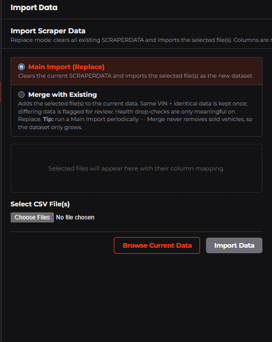
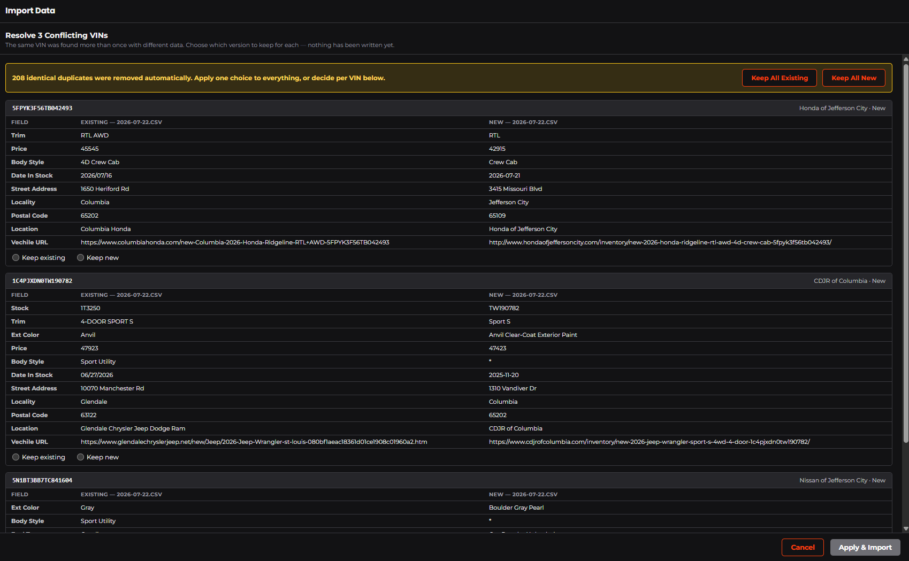
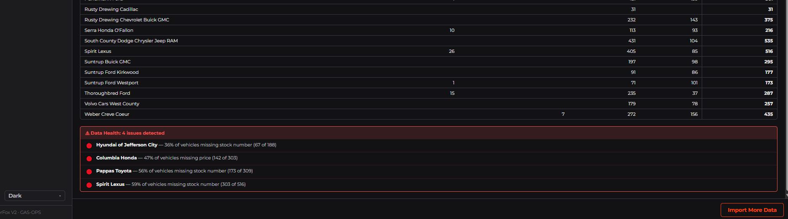
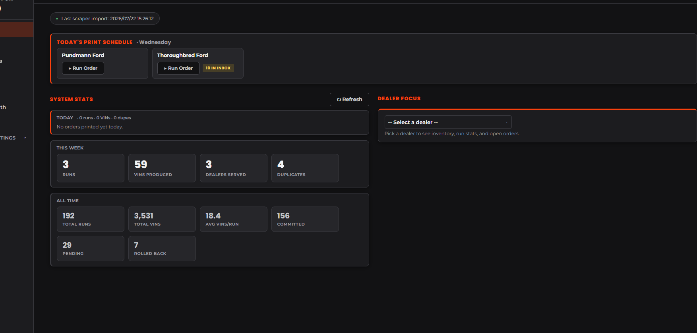
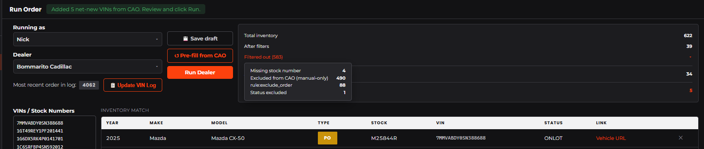
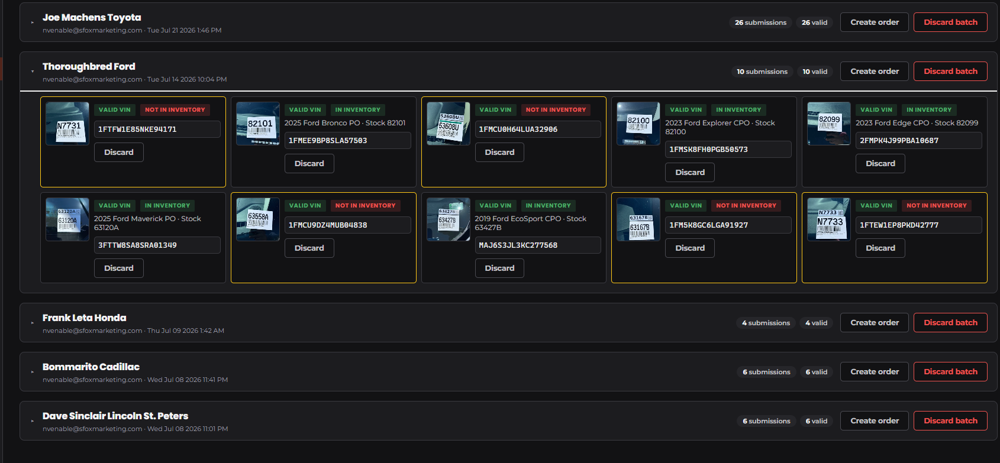
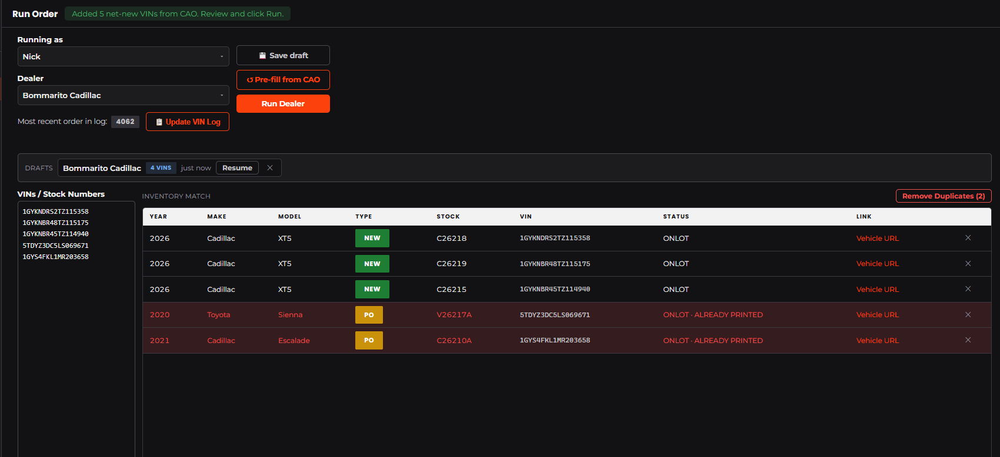
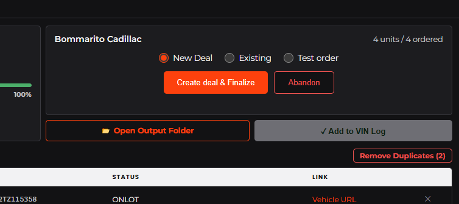
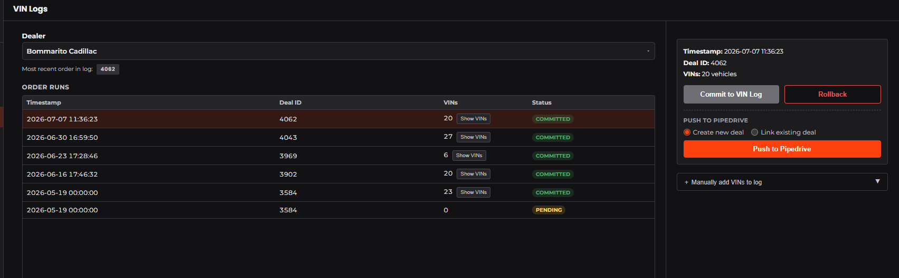

# Office Operator Handbook — SilverFox App

This is the handbook for running orders in the SilverFox app: importing the
day's inventory, turning a VIN list into the printed-graphics files, logging the
order, and sending it to Pipedrive.

The sidebar views you'll use: **Import Data**, **Home**, **Run Order**, **VIN Inbox**,
**VIN Logs**.

> **Hands off one area:** everything under **⚙ System Settings** aside from UI Settings (Dealer Rules,
> Pipedrive Settings, Normalization, etc.) — don't change anything there
without talking to Nick first. 

---

## 1 · Import scraper data — do this first

The **Import Data** view loads the scraper's inventory CSV files into the system.
Everything else — CAO pre-fills, inventory matching, the Home dashboard — runs off
this data, so a bad or stale import shows up everywhere. Import first, run orders
second. The scraper is managed by Barrett, check with him about the status of the current data.
The data lives in a shared google drive which everyone should already have access to. 

### 1a · Import scraper CSVs

**When you do this:** whenever fresh scraper files arrive — normally before the
day's orders.

**Before you start:** have the CSV file(s) downloaded, and make sure nobody else is
mid-run (the app will block with "A dealer run is in progress — wait for it to
finish before importing.").

1. Open **Import Data** in the sidebar.
   
2. Pick the mode:
   - **Main Import (Replace)** — the normal choice. Clears the old snapshot and
     loads the new files as the current dataset.
   - **Merge with Existing** — adds files on top of what's there. Use for a late
     extra file. Merge never removes sold vehicles, so don't run on Merge forever —
     do a replace daily.
3. Click **Select CSV File(s)** and pick one or more files. Each file gets a card
   showing **"N rows · N/21 columns matched"**:
   - **"✓ All 21 columns matched"** — perfect.
   - **"Missing (will be blank): …"** — those fields import blank. A missing minor
     column is fine; missing Price or Stock on a whole file is worth a question.
   - A red **✗** error ("No VIN column found — this file cannot be imported.",
     "File appears empty…") — that file won't import; deselect or fix it.
4. When the totals line says **"N files ready · N total rows"**, click **Import Data**.
5. If the **Resolve N Conflicting VINs** panel appears, work it (Section 1b). Otherwise
   the review panel appears — read the health check (Section 1c).

**What good looks like:** **✓ Import Complete**, a vehicle total in the right
ballpark for the number of files, and **"✓ Data Health: No issues detected"**.

### 1b · Resolve same-VIN conflicts

**When you see this:** the same VIN appeared more than once with *different* data - 
same VIN, different Location, Stock, Price, etc. Look for the newest date in stock.
(identical duplicates are removed automatically). **Nothing has been written yet** —
the import is paused waiting on your choices, and **Cancel** abandons it harmlessly.

1. Each conflict card shows the VIN and a field-by-field difference: **Existing** vs
   **New**, with only the differing fields listed.
2. Pick a side per VIN — **Keep existing** or **Keep new**. Usual logic: the newer
   date in stock is usually right (price drops, status changes).
3. Lots of conflicts? **Keep All Existing** / **Keep All New** applies one choice to
   everything — including any overflow conflicts not shown on screen.
4. Click **Apply & Import** (it stays disabled until every conflict has a choice).

### 1c · Read the review + health check

The **Import Complete** panel is your receipt. Give it 30 seconds — it catches
scraper problems before they become order problems.

1. **Import Summary** badges: files, mode, duplicates removed, dropped on import,
   conflicts resolved, rows without VIN. A handful of "rows without VIN" is normal
   junk; hundreds is not.
2. **Vehicle Types** / **Status Values**: types should be the usual New / PO / CPO
   / CPO-EL / Courtesy; an unexpected type gets a warning color — mention it to Nick.
3. **Breakdown by Location**: every dealer location the scraper covers should have a
   sane count. Check VS. website if totals are unusual.
4. **Health check** — the important part:
   - **"✓ Data Health: No issues detected"** → done.
   - **"⚠ Data Health: N issues detected"** → read each line:
     - 🟡 **warning** (count dropped vs. the usual, new type appeared) — proceed,
       but tell Nick if it looks odd.
     - 🔴 **error** (a location dropped to zero, or huge missing-stock/missing-price
       percentages) — **stop and investigate before running orders** for the affected
       dealers. A zeroed location usually means the scraper broke, and CAO for that
       dealer would order nothing.
   
5. **Browse Current Data** (or the **Inventory Snapshot** card) lets you spot-check
   what's actually loaded, filtered by location and type.

**If something goes wrong:**
- **"Import cancelled — nothing was written."** — exactly what it says; the old data
  is untouched. Fix and retry.
- An **"Error: …"** mid-import — screenshot it and tell Nick before retrying.
- Imported the wrong file on **Replace**? The old snapshot is gone — re-run the
  import with the right file(s), then tell Nick what happened.

---

## 2 · Start your day

**When you do this:** first thing, to see what's due.

1. Open the app — you land on **Home**.
   
2. Check the status strip at the top: **"Last scraper import: …"** should be a green
   dot (today's data). Amber/stale or "No scraper import recorded yet." → run an
   import first (Section 1) or check with Nick.
3. **Today's Print Schedule** shows every dealer scheduled today that hasn't been run
   yet. Each card has a **▶ Run Order** button that jumps straight to the Run page
   with that dealer selected. A **"N in inbox"** tag means lot-scan photos are waiting
   for that dealer — work the inbox first (Section 3b).
4. A **"📝 N drafts"** chip means you have unfinished orders saved — click it to
   resume from the Drafts strip (Section 8).
5. When the band says **"All scheduled orders printed. ✓"** — you're caught up.

**Which dealers work which way** — the routine per dealer ("How the order usually
starts" is one of: CAO / Lot scan / Manual / Combo):

| Dealer | How the order usually starts | Notes |
|---|---|---|
| Audi Rancho Mirage |INACTIVE| |
| Auffenberg Hyundai |LOT SCAN + CAO| |
| BMW of Columbia |CAO| |
| BMW of West St. Louis |LOT SCAN| |
| Bommarito Cadillac |LOT SCAN(NEW) + CAO (USED)| |
| Bommarito West County |CAO| |
| CDJR of Columbia |LOT SCAN(NEW) + CAO(USED)|2 OUTPUTS, NEW(SC) + USED(SCP) |
| Columbia Honda |CAO| |
| Dave Sinclair Lincoln |LOT SCAN| |
| Dave Sinclair Lincoln St. Peters |LOT SCAN(NEW) + CAO(USED) | |
| Dean Team Brentwood |CAO (CURRENTLY ON HOLD)| |
| Frank Leta Honda |LOT SCAN| This dealer will have 2 CSV outputs, FL Honda and AutoLoanPro|
| Glendale CDJR |CAO| |
| Honda of Frontenac |CAO| |
| Honda of Jefferson City |CAO| |
| HW Kia of West County |CAO | |
| Hyundai of Jefferson City |CAO| |
| indiGO Auto Group |INACTIVE | |
| Jaguar Rancho Mirage |INACTIVE| |
| Joe Machens Hyundai |INACTIVE| |
| Joe Machens Nissan |CAO| |
| Joe Machens Toyota |CAO| |
| Kia of Columbia |CAO| |
| Land Rover Rancho Mirage |INACTIVE| |
| Mazda of Columbia |CAO| |
| Mercedes-Benz of Creve Coeur |LOT SCAN|2 OUTPUTS, USED & SPRINTER(SCP) + CPO, CPO-EL(SC); separate PD deal for Sprinter(Automatic)|
| Mini of St. Louis |CAO| |
| Nissan of Jefferson City |CAO| |
| Pappas Toyota |CAO| |
| Porsche St. Louis |CAO| |
| Pundmann Ford |LOT SCAN(NEW)+ CAO(USED)| |
| Rusty Drewing Cadillac |INACTIVE| |
| Rusty Drewing Chevrolet Buick GMC |INACTIVE| |
| Serra Honda |LOT SCAN + CAO|2 OUTPUTS, NEW(SC) + USED(SCP)|
| SoCo DCJR |CAO| |
| Spirit Lexus |CAO|2 OUTPUTS, LOGO 1 & LOGO 3|
| Suntrup Buick GMC |INACTIVE| |
| Suntrup Ford Kirkwood |INACTIVE| |
| Suntrup Ford Westport |INACTIVE| |
| Suntrup Hyundai South |INACTIVE| |
| Suntrup Kia South |LOT SCAN (AS ORDERED)| |
| Thoroughbred Ford |LOT SCAN + CAO (BRETT SENDS PHOTOS, ASK KALEB/JOE IF NICK IS GONE)| |
| Tom Stehouwer Auto Sales |INACTIVE| |
| Twin City Toyota |INACTIVE| |
| Volvo Cars West County |CAO| |
| Weber Creve Coeur |CAO| |

*(Ask Nick if a dealer isn't in this table yet.)*

---

## 3 · Where the VINs come from — four ways an order starts

Every order ends up in the same place — the **Run Order** VIN box — but the VINs can
arrive four different ways. All four paths feed the same run flow (Section 4).

**Before you start — is the VIN log caught up?** The app's "already printed" checks
(CAO dedup, the ALREADY PRINTED flags) only know what's in the VIN log, so confirm
the dealer's latest Shortcut order actually made it in before filling the VIN box:

1. In Pipedrive, open the dealer's **Organization** → **view all deals** and find
   the most recent **VDP SC/SCP** (Shortcut) deal.
2. On the Run Order screen (after picking the dealer), check the **"Most recent
   order in log:"** line — verify it shows that same order.
3. Not matching? The last order was never committed — commit it first (Section 7),
   or find out who ran it. If you skip this check, CAO can re-order vehicles that were
   already printed.

### 3a · CAO-only (the computer picks the vehicles)

**When:** dealers whose orders come straight from current inventory.

1. Go to **Run Order**. Set **Running as** to yourself and pick the **Dealer**.
2. Click **↺ Pre-fill from CAO**. The app pulls the dealer's live inventory, applies
   that dealer's filter rules, and drops the net-new VINs into the box.
3. Read the CAO summary card: **Total inventory → After filters → Already printed →
   Net new (pre-filled)**. Click **"Filtered out (N) ▾"** to see exactly why vehicles
   were excluded (missing price, not yet seasoned, type not allowed, and so on).
   
4. Sanity-check the count. If it says **"No net-new vehicles found after filters and
   dedup."**, there's genuinely nothing new — or the inventory is stale (check Home).
5. Continue at Section 4.

### 3b · Lot scan → VIN Inbox (photos from the field)

**When:** the field crew scanned a lot and a batch is sitting in **VIN Inbox**.

1. Open **VIN Inbox**. Batches are grouped by dealer, newest info on the chips:
   **"N submissions"**, **"N/M read"**, **"N valid"**.
2. If the header shows **Run OCR (N queued)**, click it — that reads the VINs from
   the photos (up to 15 per click; click again until the queue is empty). Cards still
   waiting show a **"still processing…"** tag.
   
3. Review each card. The tags tell you everything:
   - **valid VIN** + **in inventory** → good to go (you'll see the Year Make Model line).
   - **invalid VIN** or **not in inventory** → click into the VIN field and fix it
     while looking at the photo. The tags re-check as you type — no save button needed.
   - Hopeless photo (unreadable, duplicate, not a VIN) → **Discard** that card.
4. When the batch looks right, click **Create order**. The batch's valid VINs jump
   into **Run Order** with the dealer preselected.
5. Continue at Section 4. After you finalize the run, the app offers to discard the
   batch — say yes so the inbox stays clean.

### 3c · Inbox + CAO combined

**When:** a dealer gets both — scanned vehicles the office can't see in the feed,
plus whatever CAO finds in inventory.

1. Do the inbox first: work the batch and click **Create order** (Section 3b). The
   inbox VINs are now in the Run Order box.
2. Now click **↺ Pre-fill from CAO**. CAO **appends** its net-new VINs to what's
   already in the box — it never wipes your list — and skips anything already entered
   or already printed. Any duplicates get removed automatically when you run the order (you'll see
   "Removed N duplicate VINs from the order.").
3. One order, both sources. Continue at Section 4.

### 3d · Manual VIN list

**When:** the dealer (or Nick) hands you VINs directly — email, text, printed sheet.

1. **Run Order** → set **Running as** and the **Dealer**.
2. Paste the VINs into the big box — **one per line** (stock numbers work too).
3. Continue at Section 4.

---

## 4 · Run a dealer order — the common core

By now you have: **Running as** = you, a **Dealer**, and VINs in the box. Whatever
path they came from, the rest is identical.

1. Watch the match table fill in below the VIN box. The count line reads like
   **"12 VINs · 11 found · 1 not found"**. Every row shows Year / Make / Model /
   Type / Stock / VIN / Status.
   
2. Fix what the table flags:
   - **⚠ not in this dealer** — the VIN isn't in this dealer's inventory. Check for
     a typo; remove the row with **✕** if it doesn't belong.
   - A red row with **· ALREADY PRINTED** — this vehicle is already in the dealer's
     VIN log (it was printed on an earlier order). Reprinting is usually right
     (damaged banner, dealer request) — if that's not why it's here, click
     **Remove Duplicates (N)** to drop them all, or **✕** per row. Note: dupes that
     stay in the order still get billed.
3. **Features column** (only some dealers): if the table shows a **Features** column,
   type the feature text for every row — the run won't start without it (you'll see
   "Enter Features for N rows before running: …"). Some dealers also show extra
   editable columns; the pre-filled text is a suggestion you can overwrite.
4. **Bypass filtering rules** checkbox: use it only when a vehicle you *know* belongs
   in the order keeps getting filtered out. It skips the dealer's filter rules for
   this run — so don't leave it on by habit.
5. Click **Run Dealer**. The progress card walks through the steps (usually well
   under a minute). When the header says **"Done! <dealer> order complete — finalize
   or abandon below."**, move to Section 5.

**If something goes wrong:**
- **"A data import is in progress …"** — someone's mid-import; finish or cancel that
  first (Section 1).
- The run stops with an **Error:** message about product mapping or configuration →
  screenshot it and tell Nick. That's a dealer-setup problem, not something you did.
- Almost everything filtered out unexpectedly → check the CAO summary reasons; if it
  still looks wrong, tell Nick before bypassing.

---

## 5 · Finalize the run

After a run, one or more **finalize cards** appear (a dealer with split billing gets
one card per billing account). **Nothing is logged or billed until you finalize.**

1. On each card, check the count line ("N units / N ordered") looks right.
2. Pick the method — **this is the decision that matters:**

   > **Has someone already put this order into Pipedrive?**
   > - **Yes — a deal already exists** → choose **Existing**, paste the deal's ID
   >   into **"Existing Pipedrive Deal ID"**, then click **Finalize & Link**.
   > - **No — the order hasn't been started in Pipedrive** → choose **New Deal**,
   >   then click **Create deal & Finalize**. The app creates the deal, attaches
   >   the products, and attaches the billing sheet for you.
   > - **Practice / checking output only** → choose **Test order** → **Finalize
   >   (test)**. Test runs never touch Pipedrive and never bill.

3. Success looks like **"Logged ✓ (run log row N)"** and, for real orders,
   **"✓ Pushed to Pipedrive deal #N"**.
4. Ran it by mistake, or the card shouldn't exist? Click **Abandon** — nothing is
   logged, and (if it's the last card) the output files move to Drive trash.

**If something goes wrong:**
- **"Finalize failed — nothing was logged."** → safe to try again; nothing happened.
- The card finalized but the Pipedrive push failed → the order IS logged; just click
  **Retry** on the card (or later from VIN Logs → Push to Pipedrive). If the error
  mentions product mapping, tell Nick.
- Don't close the app with unfinalized cards — it will warn you ("run results that
  haven't been finalized or abandoned"). Finalize or Abandon each card first.

---

## 6 · Get the output files

**When you do this:** right after finalizing, to hand the order to printing.

1. Click **📁 Open Output Folder**. Everything the order produced is in this Drive
   folder:
   - the **output document** (the order spreadsheet),
   - ready-made **.csv file(s)** — one per template/schema, exported automatically,
   - the **QR code PNGs** (dealers that print QR codes).
2. Download the **QR PNGs** to your computer, into **your** configured QR folder —
   the local path that belongs to the user you picked in **Running as**. Illustrator
   looks for the images at that exact path; the wrong folder = broken image links
   at print time. Not sure what your path is? Ask Nick once and write it down.
3. Grab the **.csv** file(s) for Illustrator / VersaWorks.

**What good looks like:** CSV(s) and QRs on your machine, Illustrator finds every
linked image, no "missing file" warnings.

---

## 7 · Commit the VIN log

The VIN log is the dealer's permanent record of what's been printed — it powers the
ALREADY PRINTED warnings and billing dupe checks. **It is never written automatically.**
Finalizing does NOT commit it; committing is your explicit step, done after the order
has actually gone to print.

**Right after a run:** click **✓ Add to VIN Log** at the bottom of the Run page
(it lights up once at least one real — non-test — card is finalized). It commits all
finalized cards at once and locks to **"✓ Added N VINs"**.

**Later, or for cleanup:** open **VIN Logs**:
1. Pick the **Dealer** (or browse All Dealers), find the run in **Order Runs** —
   status shows **pending** / **committed** / **rolled_back**.
2. Select it → **Commit to VIN Log**.
   
3. Committed the wrong run? Select it → **Rollback**. That removes exactly that
   run's entries and marks it rolled_back (you can re-commit later).
4. **＋ Manually add VINs to log** covers work done outside the system: enter the
   order number and one VIN per line → **Add to VIN Log**.
5. **Show VINs** on any run pops up its full VIN list with a **Copy** button.

**Rules of thumb:** commit when the order prints, not before. Test runs can't be
committed (the app blocks them). If billing looks wrong because of a bad commit,
rollback, fix, re-commit — and tell Nick what happened.

---

## 8 · Order drafts — never lose a half-built order

The Run page auto-saves your work-in-progress (typed VINs, feature text, edits)
whenever you switch dealers or leave the page, and every 15 seconds while you type.
**💾 Save draft** saves on demand.

- Resume from the **Drafts** strip at the top of Run Order — each draft shows the
  dealer, "N VINs", how old it is, and a **Resume** button. The **📝 N drafts** chip
  on Home jumps you there.
- A draft deletes itself when you run the order successfully. Delete stale ones
  with **✕**.
- Drafts are per-person: yours don't appear for other operators.

---

## 9 · When a run goes wrong — quick reference

| You see | What it means | What to do |
|---|---|---|
| "Please select a user / dealer / at least one VIN." | Something required is missing | Fill it in |
| "Enter Features for N rows before running" | Features dealer, blank rows | Type features for the listed VINs |
| "A data import is in progress …" | Import running or stuck mid-conflict | Finish/cancel the import first |
| Error mentioning product mapping / configuration | Dealer setup problem | Screenshot → Nick. Not your fault |
| "No net-new vehicles found after filters and dedup." | CAO found nothing new | Usually fine; if suspicious, check Home import freshness |
| Red row · ALREADY PRINTED | Vehicle already in the VIN log | Keep only if a reprint is intended; it will bill |
| "Finalize failed — nothing was logged." | Finalize didn't take | Just try again |
| Pipedrive push failed (after "Logged ✓") | Order logged; billing push didn't | **Retry** on the card, or VIN Logs → Push to Pipedrive |
| "Could not load …" anywhere | Network/Google hiccup | ↺ Refresh; if it persists, tell Nick |

**Golden rules:** never finalize as **Test** to "skip Pipedrive" on a real order —
test runs can't be committed or billed. Never touch **⚙ System Settings**. When an
error names a rule, mapping, or config — that's Nick's, screenshot and send.
